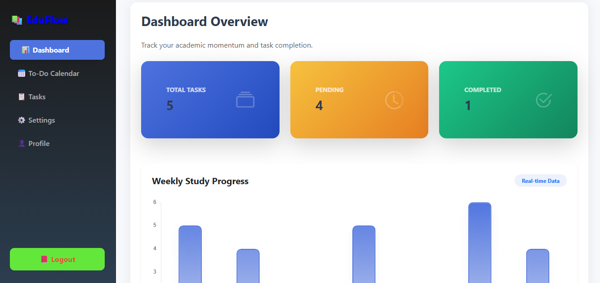
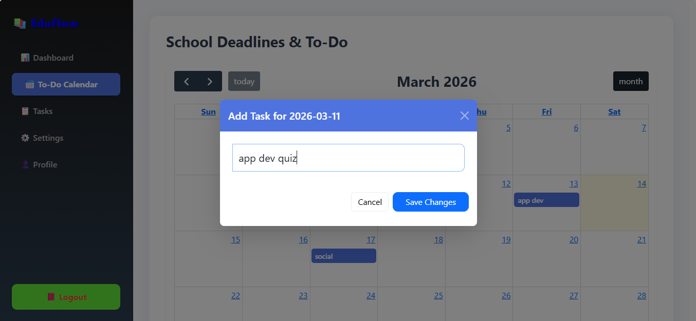
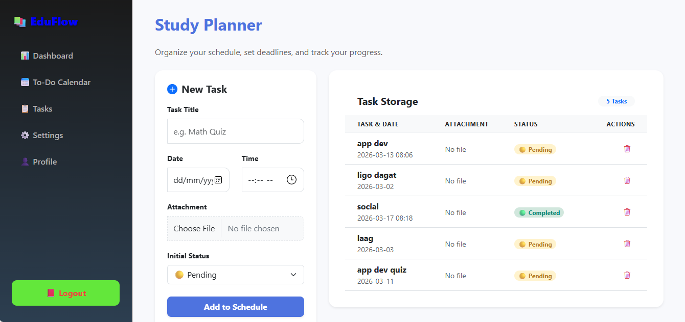

  

A progressive <a href="http://nodejs.org" target="_blank">Node.js</a> framework for building efficient and scalable server-side applications.

# EduFlow: Academic Planner

## Student Information
- **Name:** MACABUHAY, JUNNEL P.  
- **Application:** EduFlow Academic Management System  

---

# Overview
This project is an **EduFlow web application** designed specifically for students to manage their academic life efficiently. The application provides a centralized dashboard where users can track school deadlines, visualize their schedule through an interactive calendar, and monitor study progress via data-driven graphs.

The system includes a **Task Management system** and an **Interactive To-Do Calendar**, helping students stay organized and ahead of their academic requirements.

The system is designed to run **locally** (via NestJS and MySQL), ensuring fast performance and reliability for daily student use.

# Implemented Features

For this assignment, two primary features were implemented in the EduFlow application:

1.  **Interactive To-Do Calendar** (Add/Edit/Delete)
2.  **Academic Dashboard Overview** (Vibrant Data Visualization)

---

# Feature 1 – Interactive To-Do Calendar

### Purpose
The purpose of this feature is to provide a visual timeline of all school deadlines, allowing students to plan their study sessions and manage time effectively.

### Expected User
Students who need a bird's-eye view of their upcoming quizzes, assignments, and project deadlines.

### Main Functionality
The system utilizes **FullCalendar.js** to provide a dynamic monthly grid where users can:
* **Click a date box** to add a new academic task.
* **Click existing tasks** to edit the description or delete them once completed.
* **View tasks** as vibrant labels directly on the calendar grid.

Data is persisted through `localStorage` and synced with the backend to ensure the calendar is always up to date.

### Acceptance Criteria
* The user must be able to click any date to trigger the Add Task modal.
* The user must be able to enter a task description.
* The task must appear as a colored label on the selected date.
* The user must be able to edit or update the task title by clicking it.
* The user must be able to delete/remove a task upon completion.
* Changes must be saved and persist after page refresh.

---

# Feature 2 – Academic Dashboard Overview

### Purpose
The purpose of this feature is to provide a high-level summary of a student's workload through vibrant, interactive statistics and graphs.

### Expected User
Students who want to monitor their overall productivity and see exactly how many tasks are pending versus completed.

### Main Functionality
The dashboard serves as the command center, featuring:
* **Vibrant Stat Cards:** High-contrast cards showing Total Tasks, Pending Tasks, and Completed Tasks.
* **Progress Graph:** A Chart.js-powered line or bar graph showing study activity.
* **Quick Navigation:** A specialized button to trigger "Focus Mode" for deep work sessions.

The charts and numbers update in real-time as tasks are modified in the Calendar or Task Manager.

### Acceptance Criteria
* The dashboard must display three distinct stat cards (Total, Pending, Completed).
* The system must calculate counts automatically from the task database.
* The Weekly Progress Graph must render correctly using Chart.js.
* The interface must include a vibrant "Enter Focus Mode" button in the header.
* The layout must be responsive and visually consistent with the sidebar design.

---

# What I Implemented

The following functionality was implemented in the application:
* An **Interactive To-Do Calendar** with full CRUD (Create, Read, Update, Delete) capabilities.
* A **Vibrant Dashboard** with data visualization and progress tracking.
* A **Task Management System** with file attachment support and status toggles.
* A **Focus Mode (Pomodoro Timer)** with glassmorphism design for deep work.
* A **User Profile and Settings** module for account customization.

---

# Challenges Encountered

* **State Synchronization:** Ensuring that a task added in the Calendar immediately reflected in the Dashboard stat counts.
* **NestJS Static Assets:** Configuring `main.ts` to correctly serve the frontend files from the `public` directory.
* **Chart.js Integration:** Customizing the gradient fills and responsiveness of the charts to maintain a "vibrant" aesthetic.
* **FullCalendar Event Handling:** Mapping custom `localStorage` IDs to FullCalendar's internal event objects for seamless editing.

---

# Screenshots

### Academic Dashboard Overview

### Interactive To-Do Calendar

### Task Management List

---

# Technologies Used

### Frontend
* HTML5 & CSS3 (Custom Gradients)
* JavaScript (Vanilla ES6+)
* Bootstrap 5 (UI Framework)
* FullCalendar.js (Calendar Component)
* Chart.js (Data Visualization)

### Backend
* NestJS
* TypeScript

### Database
* MySQL
* phpMyAdmin (WAMP)
* localStorage (Client-side redundancy)

---

## License
Nest is [MIT licensed](https://github.com/nestjs/nest/blob/master/LICENSE).